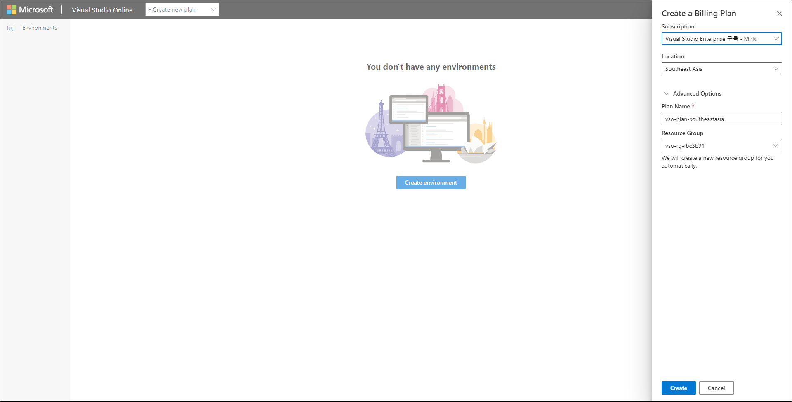
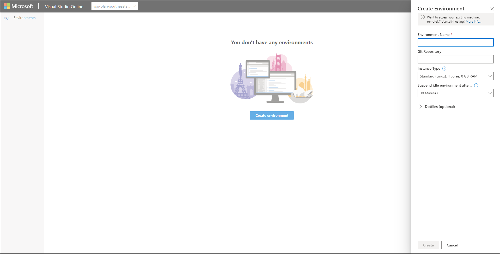
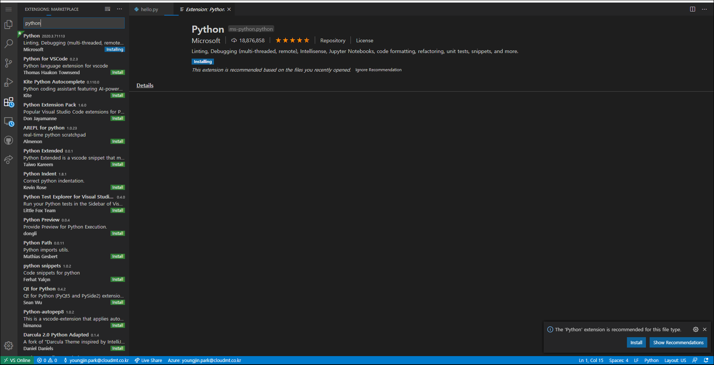
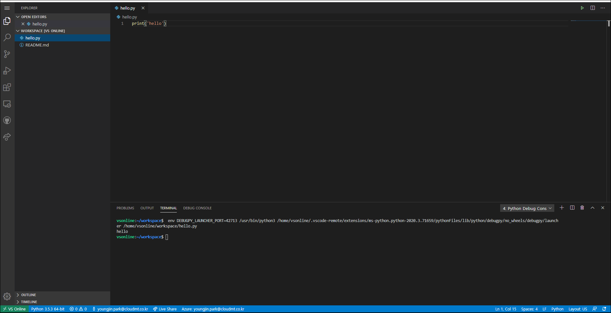

# Visual Studio Online 사용법
- 특징 : 대부분의 프로그래밍 언어를 지원, 이미 설치되어있는 가상 환경을 제공하고,  
개인의 최소한의 셋팅으로 어디서든 협업할 수있는 툴을 제공하고 있다.
## 로그인
- https://online.visualstudio.com/login
- 로그인 후 첫 화면


## Main 페이지 설명
### (상단) Create new plan
- 새로운 Plan 생성

- plan을 통해 과금이 되는듯?
### Environments
- Project를 진행할 remote server 생성.

```buildoutcfg
Environment Name : 프로젝트 환경 이름
Git Repository : 자동생성인듯.
Instance Type : Standard (Linux): 4 cores, 8 GB RAM,
                Preminum (Linux): 8 cores, 16 GB RAM. 두가지가 있음.
               

```
- [가격플랜 보기](https://azure.microsoft.com/ko-kr/pricing/details/visual-studio-online/)

## Web visual studio 생성
- Environment 생성 후 화면

- 첫 생성시 connection 오류가 뜰수있음.
- 성공시

- Visual Code와 인터페이스가 똑같아 보임.
- 왼쪽 메뉴
```
Explorer : 프로젝트 탐색기
Search : 찾기기능
Source Control : 소스 컨트롤
Run : 소스코드 실행
Extensions : 확장기능
Remote Explorer : host 서버의 env 탐색기
Github Pull Requests : github의 풀리퀘스트기능
Live Share : 코드 협업 기능
```

## python 실행해보자.
- hello.py 파일 생성

- Extension에서 Python 설치

- 설치 후 Reload 필요.
- 실행(F5)


## frontweb을 띄워보자.

### Nodejs
- [참고페이지](https://code.visualstudio.com/docs/nodejs/nodejs-tutorial)
- [참고영상](https://channel9.msdn.com/Series/Visual-Studio-Online-Monaco/Getting-started-with-nodejs)
- 명령어
```
npm install
npm start
```
### python Django
- [sample project](https://github.com/mate365/python_web_example)
- 