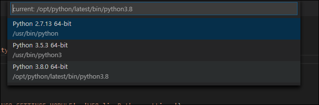
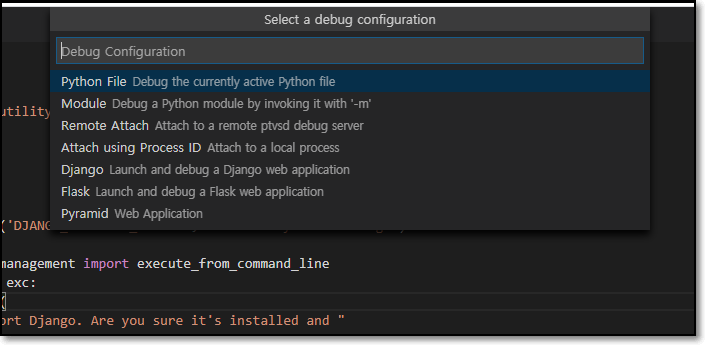

# Visual Studio Online 사용법
- 특징 : 대부분의 프로그래밍 언어를 지원하는 가상 환경을 제공하고,  
최소한의 IDE 셋팅으로 어디서든 작업 혹은 협업할 수있는 툴을 제공하고 있다.
## 로그인
- https://online.visualstudio.com/login
- 로그인 후 첫 화면


## Main 페이지 설명
- Plan, Environment 두가지 생성만으로 사용 할 수있다. 
### 1. Create new plan
- 새로운 Plan 생성

- 생성할 Azure Subscription 지정하고, 해당 Plan에 대한 리소스 생성.  
### 2. Environments
- Plan 위에서 Project를 진행할 remote server 생성.

```buildoutcfg
Environment Name : 프로젝트 환경 이름
Git Repository : 비워두거나, git 주소 입력
Instance Type : Standard (Linux): 4 cores, 8 GB RAM,
                Preminum (Linux): 8 cores, 16 GB RAM. 두가지가 있음.
```
- [가격플랜 보기](https://azure.microsoft.com/ko-kr/pricing/details/visual-studio-online/)

## Web visual studio 생성
- Environment 생성 후 화면

- 첫 생성시 connection 오류가 뜰수있음. (Reload)
- 성공시

- Visual Code와 인터페이스가 똑같아 보임.
- 왼쪽 메뉴
```
Explorer : 프로젝트 탐색기
Search : 찾기기능
Source Control : 소스 컨트롤
Run : 소스코드 실행
Extensions : 확장기능
Remote Explorer : host 서버의 env 탐색기
Github Pull Requests : github의 풀리퀘스트기능
Live Share : 코드 협업 기능
```

## python 실행해보자.
- hello.py 파일 생성

- Extension에서 Python Extension 설치를 통해 사용가능.

- 설치 후 Reload 필요.
- 실행(F5)


## frontweb을 띄워보자.
- host에 어떻게 접근할까?
```
좌측 메뉴 remote explorer > 좌측하단 Forwarded Ports 추가 > 실행시킬 웹서버 포트 입력
> 만들어진 메뉴를 통해 host로 접속할수 있음.
```

- 
### Nodejs
- [예제 소스](https://github.com/mate365/AzureDevOps_ProblemSolving.git/tree/master/src)
- [참고페이지](https://code.visualstudio.com/docs/nodejs/nodejs-tutorial)
- [참고영상](https://channel9.msdn.com/Series/Visual-Studio-Online-Monaco/Getting-started-with-nodejs)
- 서버 실행 명령어
```
npm install
npm start
```
- 실행화면

- Forwarded Ports 추가를 통해 웹서버 접속 확인.
### python Django
- [sample project](https://github.com/mate365/python_web_example)
- 버전 선택

- `Python: Select Interpreter` 을 통해 버전을 선택한다.
- `pip install -r requirements.txt`을 통해 패키지 설치한다.
- Run(F5)를 통해 django 서버 실행.


- Python Extension 설치후 Run(F5) 하게되면 위와 같은 화면이 뜬다. Django를 골라 run 할수있다.
- IDE 자체 Run 기능은 django runserver 를 지원하고있다.

### 중간 후기
- visual code를 사용하는것과 매우 유사. 강력한 Extension 기능을 그대로 사용할수있음.
- Local환경이아닌 VM환경에서 모든 작업이 돌아감.
- 따라서 Local 환경을 따로 구성하지않아도 되는 편함이 있음.
- vscode의 extension을 통해 vscode APP 에서 그대로 사용가능하다.
[참고링크1](https://evols-atirev.tistory.com/28)
[참고링크2](https://code.visualstudio.com/docs/remote/vsonline)